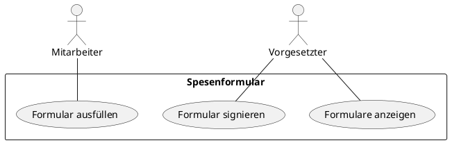

# Use Cases

## Beschreibung der Use-Cases

| Use Case 1           |       Ausfüllen des Formulares       |
| -------------------- | ----------------------------------   |
| Akteure              |             Mitarbeiter              |
| Ziel im Kontext      |      Spesenabrechnung ausfüllen      |
| Trigger              |        User ruft Formular auf        |
| Essenzielle Schritte | 1. Mitarbeiter ruft Formular auf.    2. Mitarbeiter füllt Formular aus.   3. Mitarbeiter schickt Formular ab.   4. Formular besätigt dem User die Übermittlung.
| Eweriterungen | 1. Essensspesen zu hoch, resultiert in Fehlermeldung   2. Leere Eingabe, resultiert in Fehlermeldung

| Use Case 2           |       Unterschreiben des Spesenformulares       |
| -------------------- | ----------------------------------   |
| Akteure              |             Vorgesetzter              |
| Ziel im Kontext      |      Spesenabrechnung freigeben      |
| Trigger              |        Vorgesetzter ruft ausgefülltes Formular auf        |
| Essenzielle Schritte | 1. Vorgesetzter ruft Formular auf.    2. Vorgesetzter trägt Unterschrift ein.   3. Vorgesetzter schickt Formular ab.   4. Formular besätigt dem Vorgesetzen die Übermittlung.
| Eweriterungen | 1. Leere Eingabe, resultiert in Fehlermeldung |

| Use Case 3          |        Spesenformulare anzeigen      |
| -------------------- | ----------------------------------   |
| Akteure              |             Vorgesetzter              |
| Ziel im Kontext      |      Alle Spesenabrechnungen anzeigen      |
| Trigger              |        Vorgesetzter ruft spezielle View auf        |
| Essenzielle Schritte | 1. Vorgesetzter ruft View auf. |
| Eweriterungen | - |

## Beschreibung der Akteuren

| Akteure         |        Beschreibung      |
| -------------------- | ----------------------------------   |
| Vorgesetzter              | Vorgesetzter visiert ausgefültle Formulare. Ausserdem hat er die möglichkeit, alle bestehenden Spesenformulare anzuzeigen.          |
| Mitarbeiter     |      Der Mitarbeiter kann das Spesenformular aufrufen und ausfüllen. Er hat keinen Zugriff auf die View aller Spesenformulare.      |

## Diagramm der Use-Cases

## Beschreibung der funktionalen Anforderungen (als Ableitung aus den Use-Cases)

- User erfasst Name und Personalnummer
  - Personalnummer auf glültigkeit der Länge überprüfen (6 Stellig)
- User erfasst Datum (Datumsfeld)
  - Wenn Reise >1 Tag, Übernachtungskosten einblenden
- User erfasst Reiseort und Zeitpunkt der Hin- und Rückfahrt
  - Dropdown für Auswahl des Reisemittels
  - Je nach Auswahl andere Spesen
- User erfasst Spesen (Essen, Fahrtspesen, Übernachtung etc.)
  - Fahrtspesen werden automatisch berechent gemäss gefahrener Kilometer
  - Essensbeträge können nicht unendlich gross sein (Richtwert)
- User kann ggf. Anhänge (Quittungen) hochladen
- Gesamtbetrag wird berechnet
- Formular muss vom Vorgesetzten unterzeichnet werden
- Ausgefüllte Formulare können vom Vorgesetzen angezeigt werden

## Analyse der Daten welche übertragen/erfasst werden (Spezifikation, Datentypen, Spezialfälle, Fehlerfälle, Wertebereich

| Daten           |       Datentyp       |
| -------------------- | ----------------------------------   |
| Name              |             String              |
| Personalnummer | int |
| Datum  | date |
| Reiseziel | string |
| Essenskosten  | double |
| Fahrtkosten   | double |
| KM-Anzahl | double |
| Übernachtung | double |
| Verkehrsmittel | String |
| Unterschrift | boolean |
