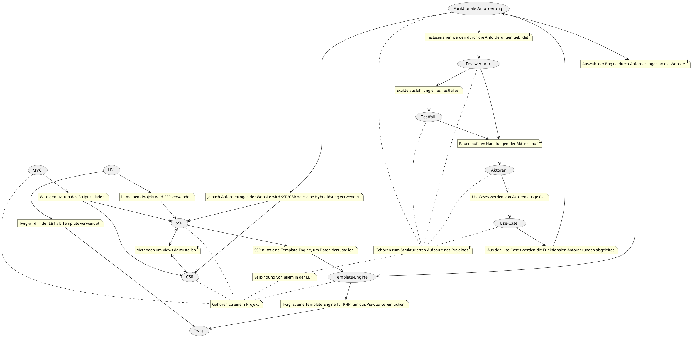

# Concept Map Abgabe 1

## Zu verwendende Begriffe

- SSR/ CSR
- MVC
- Template-Engine
- Use-Case
- Aktoren
- Funktionale Anforderung
- Testszenario
- Testfall

### Zusätzliche Begriffe

- Twig
- LB1

## Concept Map

