# Concept Map Abgabe 1

## Zu verwendende Begriffe

- SSR/ CSR
- MVC
- Template-Engine
- Use-Case
- Aktoren
- Funktionale Anforderung
- Testszenario
- Testfall

## Concept Map

```plantuml
@startuml
(SSR/ CSR) as (SSRCSR)
(MVC)
(Template-Engine) as (TemplateEngine)
(Use-Case) as (UseCase)
(Aktoren)
(Funktionale Anforderung) as (FunktionaleAnforderung)
(Testszenario)
(Testfall)
---

@enduml
```

```plantuml
@startuml
(Scripting-Sprachen) as (ScriptSprachen)
(PHP)
(Python)
(Bash)
(Webapplikation) as (Web)
(Web) <--- (PHP)
(Web) <--- (Python)
(ScriptSprachen) <---> (PHP)
(ScriptSprachen) <---> (Python)
(ScriptSprachen) <---> (Bash)
note right of (PHP)
 PHP ist eine Scriptsprache
 die sich besonders für
 Webapplikationen eignet
end note
note right of (Python)
 Python ist eine Scriptsprache
 die sehr modular aufgebaut ist.
 Sie kann für fast alles verwendet werden.
 Der Syntax wird häufig als einfach beschrieben.
end note
note "Wird für Webapps \n eingesetzt" as NWebapps
(ScriptSprachen) .. NWebapps
NWebapps .. (PHP)
@enduml
```


