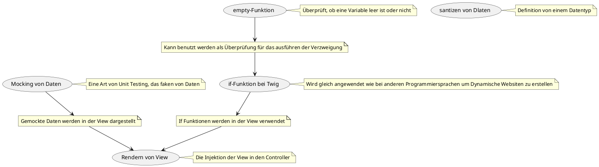

# Concept Map Abgabe 1

## Zu verwendende Begriffe

- if-Funktion bei Twig
- Mocking von Daten
- Rendern von View
- empty()-Funktion
- santizen von Daten

## Concept Map

```plantuml
@startuml
(if-Funktion bei Twig) as (IfTwig)
note right of (IfTwig) 
Wird gleich angewendet wie bei anderen Programmiersprachen um Dynamische Websiten zu erstellen
end note
(Mocking von Daten) as (Mocking)
note right of (Mocking)
Eine Art von Unit Testing, das faken von Daten
end note
(Rendern von View) as (rendern)
note right of (rendern)
Die Injektion der View in den Controller
end note
(empty-Funktion) as (empty)
note right of (empty)
Überprüft, ob eine Variable leer ist oder nicht
end note
(santizen von Dlaten) as (santizen)
note right of (santizen)
Definition von einem Datentyp
end note

note "Kann benutzt werden als Überprüfung für das ausführen der Verzweigung" as NoteIf
(empty) --> NoteIf 
NoteIf --> (IfTwig)

note "Gemockte Daten werden in der View dargestellt" as NoteMock
(Mocking) --> NoteMock
NoteMock --> (rendern)

note "If Funktionen werden in der View verwendet" as NoteView
(IfTwig) --> NoteView
NoteView --> (rendern)


@enduml
```
