# Concept Map Abgabe 2

## Zu verwendende Begriffe

- mysql-Datenverbindung (alte Extension)
- mysqli-Datenverbindung (improved Extension)
- PDO-Datenverbindung (alte Extension)
- PostgreSQL
- MySQL
- Prepared-Statement
- SQL-Injection

### Zusätzliche Begriffe

- Wrapper Funktionen
- Initscript
- Docker
- Adminer

## Concept Map

```plantuml
@startuml

(mysql-Datenverbindungvalte Extension) as (mysqlVerbindung)
note right of (mysqlVerbindung) 
Alte, ursprüngliche Art und Weise, ab PHP Version 7 verboten oder nicht möglich anzuwenden.
Niedrige perfomance, rein prozedural, keine OOP.
endnote
(mysqli-Datenverbindung improved Extension) as (mysqliVerbindung)
note right of (mysqliVerbindung) 
Ist prozedural und OOP, was viele Möglichkeiten bietet. Nachteil, da viele Wege zum Ziel führen. 
Hohe performance und hohe Verbreitung, da einfach umzusetzen.
endnote
(PDO-Datenverbindung alte Extension) as (PDOVerbindung)
note right of (PDOVerbindung) 
Rein OOP, Verbreitung daher eingeschränkt.
Hohe performance, einheitliche Schnittstelle für viele Datenbanken. Ähnliche Performance wie mysqli.
endnote
(PostgreSQL)
note right of (PostgreSQL) 
PostgreSQL ist ein Objekt-relationales Datenbankverwaltungssystem und ist OpenSource. Ist in den meisten Linux Distros vorhanden und wird von Apple als Standard verwendet.
endnote
(MySQL)
note right of (MySQL) 
Relationales Datenbankverwaltungssystem, welches OpenSource ist.
Wird häufig zusammen im LAMB stack für Webservices eingesetzt.
endnote
(Prepared-Statement) as (PreparedStatement)
note right of (PreparedStatement) 
Datenbankfunktion, welche SQL Statements ausführt.
endnote
(SQL-Injection) as (SQLInjection)
note right of (SQLInjection) 
SQL Injection bedeutet, wenn in einen String ein SQL Befehl mitgegeben wird. Jener kann verschiedenen Schaden anrichten wie z.B. alle Daten löschen oder dem Angreifer Adminrechte vergeben.
Das ganze kann mit einer sauberen Inputvalidierung, kombiniert mit Sanitizen und der Funktion "MySQLrealescapestring".
endnote
(WrapperFunktion)
note right of (WrapperFunktion) 
Wrapper Funktionen sind Methoden welche sich im Core befinden und diverse PHP(und andere)einfache aufgaben übernehmen können, wie zum Beispiel Querys, Bindings oder Executes.
endnote
(Initscript)
note right of (Initscript) 
Die Initscripts werden automatisch ausgeführt, wenn MySQL data leer ist. Die Scripts werden beim Start vom Docker Compose up ausgeführt. 
Die Initscripts sind dazu da, automatische Testdaten via SQL Befehle zu generieren.
endnote
(Docker)
note right of (Docker) 
In unserer Umgebung nutzen wir Docker mit 3 Containern. Jene sind wie Vieh zu behandeln und sollten jederzeit gelöscht werden können.
endnote
(Adminer)
note right of (Adminer) 
Der Adminer ist eine Art Low Profile php myadmin, welches sehr viel schlanker ist. Der Zugriff (bei uns, wird in der Config definiert) ist über localhost:8080
endnote

note "Sind alles Datenverbindungen" as NoteDatenverbindung
(mysqlVerbindung) --> NoteDatenverbindung 
(mysqliVerbindung) --> NoteDatenverbindung
(PDOVerbindung) --> NoteDatenverbindung

note "Sind beide DBMS" as NoteDBMS
(PostgreSQL) <--> NoteDBMS 
NoteDBMS <--> (MySQL) 

note "Können als Verbindung der Datenbank genutzt werden" as NoteVerbindung
(MySQL) --> NoteVerbindung
(PostgreSQL) --> NoteVerbindung
NoteVerbindung --> (PDOVerbindung)
NoteVerbindung --> (mysqliVerbindung)
NoteVerbindung --> (mysqlVerbindung)


note "Werden beim Start von Docker-Compose ausgeführt" as NoteInit
(Initscript) --> NoteInit
NoteInit --> (Docker)

note "Ist ein Docker Container, welcher das erstellen und Managen von Tables und Daten vereinfacht." as NoteAdminier
(Adminer) --> NoteAdminier
NoteAdminier --> (Docker)

note "Können einfache Funktionen wie Querys enthalten" as NoteWrapper
(WrapperFunktion) --> NoteWrapper
NoteWrapper --> (MySQL)
NoteWrapper --> (PostgreSQL)

note "Ist in unserem Projekt ein Docker Container, welcher als Datenbank fungiert." as NoteSQLContainer
(MySQL) --> NoteSQLContainer
NoteSQLContainer --> (Docker)

note "Die Initscripts werden in MySQL abgelegt." as NoteSQLInit
(Initscript) --> NoteSQLInit
NoteSQLInit --> (MySQL)

note "Durch Prepared Statements können SQL Injections abgefangen und gefiltert werden." as NoteStatementInjection
(PreparedStatement) --> NoteStatementInjection
NoteStatementInjection --> (SQLInjection)

note "Die Datenverbindung erzeugen und nutzen Prepared Statements." as NoteStatementVerbindung
(PDOVerbindung) --> NoteStatementVerbindung
(mysqlVerbindung) --> NoteStatementVerbindung
(mysqliVerbindung) --> NoteStatementVerbindung
NoteStatementVerbindung --> (PreparedStatement)

note "SQL Injections können gezielt DB angreiffen." as NoteDB
(SQLInjection) --> NoteDB
NoteDB --> (MySQL)
NoteDB --> (PostgreSQL)

note "Kann Tables erstellen und Daten erzeugen" as NoteAdminerSQL
(Adminer) --> NoteAdminerSQL
NoteAdminerSQL --> (MySQL)

@enduml
```

