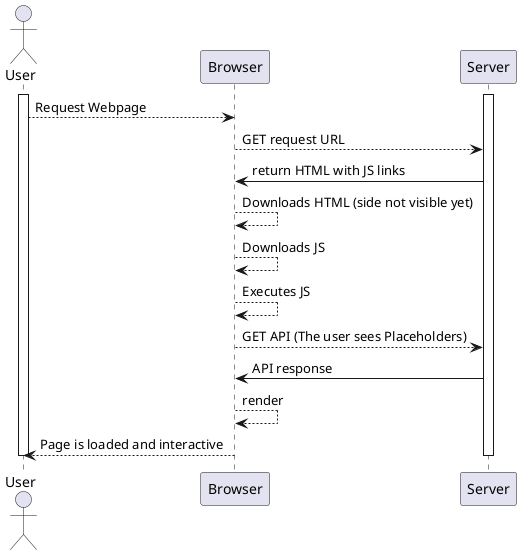

# SSR und CSR

## Was ist SSR

SSR kam in Vergangenheit immer mehr zur Geltung, da sich Webseiten stets weiterentwickelt haben weil nun das Javascript Framework zur Erstellung von Websiten genutzt wird.

SSR ist eine Methode um JavaScript direkt auf dem Server zu laden. Wenn jemand eine Seite anfordert, wird jene als statische HTML Seite dargestellt.

### Warum SSR verwenden?

SSR ist eine sehr gute Lösung, falls Enduser eine sehr langsame Verbindung oder ein sehr langsames Gerät besitzen, da das ganze Rendering auf dem Server stattfindet.

## Was ist CSR

CSR ist die Alternative zu SSR. Beim Client side rendering wird das JS der Website im Browser des Users geladen und nicht mehr auf dem Server.
Websites, welche mit FrontEnd JavaScript Frameworsks wie Angular oder React erstellt werden, verwenden standardmässig CSR.

## Das Problem mit SEO

Da Google Webseiten indiziert, dauert dies meist einige Stunden. Jedoch werden nur HTML, CSS und Links extrahiert.
Der JavaScript Teil wird in eine Queue eingereiht und erst gerendert, wenn er freie Ressourcen hat. Dies kann viele Tagen oder gar Wochen dauern. In dieser Zeit wird die Website nicht indiziert und so entgeht Traffic.

Es kann sogar vorkommen, dass die Seite nicht richtig gecrawlt werden und Google die Website als leere Seite liest und als jene einstuft.
Andere Suchmaschinen sind überhaupt nicht in der lage, JavaScript zu crawlen.

Die Lösung für das Problem ist SSR. JavaScript wird direkt auf dem eigenen Server gerendert, somit wird der Inhalt dem User schnell zugänglich gemacht.
Ebenfalls können wichtige Seiten auch einfach Statisch erstellt werden, damit die Schlüsselwörter gefunden werden können.

## Vor und Nachteile SSR

Vorteile SSR:

- Bessre crawl möglichkeit (SEO)
- Schneller Initialaufruf der Webseite
- Optimiert für Social Media

Nachteile SSR:

- Mehr Serverrequests
- Evt. Latenzen
- Seiten werden immer ganz neu geladen
- teurer als CSR
- Schwieriger zu implementieren

## Vor und Nachteile CSR

Vorteile CSR:

- Schnellere Website NACH Initialaufruf
- Seite lädt nicht neu

Nachteile CSR:

- Mehr Memory Auslastung
- Langsamer Initialaufruf

## CSR

