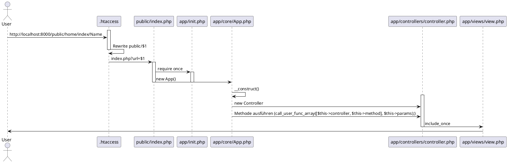
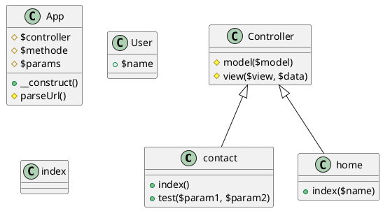

# Model View Controller (MVC)

Dies erreichen wir unter anderem mit einer einheitlichen URL.

`http://http://hostname:8000/home/index/param1/param2`

Home steht für den Controller und Index ist die Methode.

Bedingungen:

- Saubere Ablagestruktur
- Controller gemäss URL
- Methode gemäss URL
- URL muss richtige Infos herausholen
- Rendering der View wird vom richtigen Model über den Controller ausgelöst
  
## Sequenzdiagramm

Sequenzdiagramm eines Websitenaufrufes.

## Klassendiagramm

Klassendiagramm des Frameworkes:

